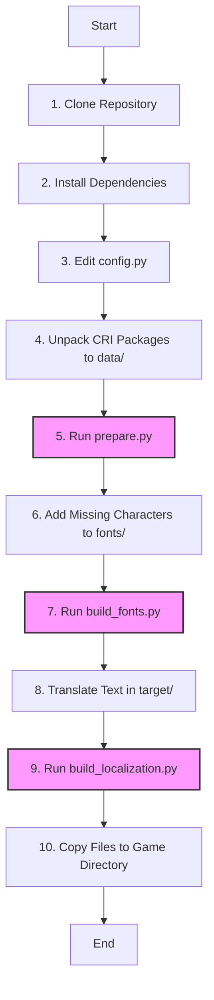
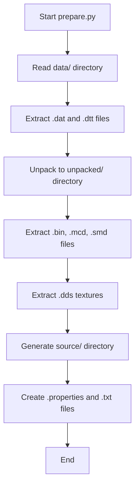
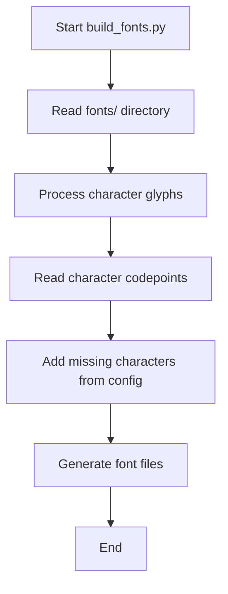
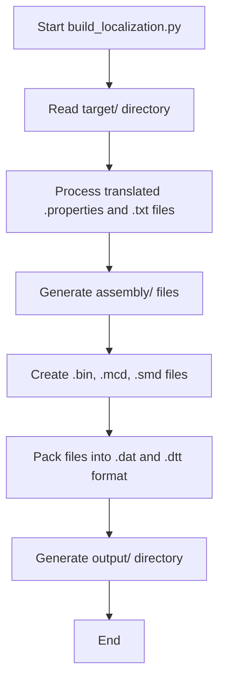

# Nier: Automata Localization Tool Refined

A fork of [nier_automata_localization](https://github.com/synspawacza/nier_automata_localization), aim to be easier to use, and based everything on python instead of shell scripts while maintaining backward compatability (using python argparse). OmegaT is not required.
Toolset for creating unofficial localization of Nier: Automata

## Getting Started

These instructions will get you a copy of the project up and running on your local machine for development and testing purposes.

### Prerequisites

* Python 3
  * tested with Python 3.12.4, but versions from 3.10 should work too.
* ImageMagick 7.1.1 (or newer)
  * tested with ImageMagick 7.1.1-33 Q16-HDRI x64

### Setup

1. Clone this repository
2. Install dependencies: `pip install -r requirements.txt`
3. Edit `config.py` to match your desired settings.
    * `chars_to_add` - list of characters in your language.
    * `srcLang` - source language you want to translate from. (default: en)
    * `targetLang` - target language you want to translate to. (can be any format, but 2-letter ISO code is recommended for simplicity)
4. Unpack CRI packages from the game to `data/` directory. ([CriPakGUI](https://github.com/wmltogether/CriPakTools/releases) can be used)
5. Run `prepare.py` to unpack files and generate `source/` directory (this should be done only once)
6. Fonts
    1. Add missing characters in `fonts/`. Name of the character should be codepoint number as a 4-digit hex, e.g. `0e01.png` for
       letter 'ก' (Thai Kor Kai character).
    2. Run `build_fonts.py` to generate font files
7. Translation
    1. Translate text to your language directly in `target/` directory.
    2. Run `build_localization.py` to generate `output/`
8. Copy files from `output/` to `<game directory>/data/`

### Directories structure

* `data/` - \*.dat and \*.dtt files extracted from CRI packages (\*.cpk)
* `fonts/` - font data - glyph images
* `unpacked/` - untranslated raw files (\*.bin, \*.mcd, \*.smd, etc.) extracted from \*.dat and \*.dtt files. \*.dds textures are also extracted
* `source/` - source \*.properties and \*.txt files for translation
* `target/` - \*.properties and \*.txt files translated to target language
* `assembly/` - translated raw files (\*.bin, \*.mcd, \*.smd, etc.)
* `output/` - translated \*.dat and \*.dtt files

### Notes

> Will remove these in the future cuz we don't need OmegaT anymore

OmegaT is not handling properly values in .properties files ending with backslash. Value `key=\\` is interpreted as escaping endline
rather than escaped backslash. For that reason dummy value `<removeme>` is added. It should be removed during translation.

Glyphs for some of the fonts have color data in transparent parts. Some image editors will lose this information when exporting to PNG.
Losing this data will cause these characters to render incorrectly. To get around this following ImageMagick commands can be used:
```
magick glyph.png -alpha extract glyph_alpha.png # extract alpha channel
magick glyph.png -alpha off glyph_color.png     # extract color channels
magick glyph_color.png glyph_alpha.png -alpha off -compose CopyOpacity -composite glyph.png # combine alpha and color
```

## Acknowledgments

Resources used during development:
* Russian translations by Rindera (https://steamcommunity.com/sharedfiles/filedetails/?id=1206296158) and The Miracle (https://steamcommunity.com/sharedfiles/filedetails/?id=889954753)
* General information on files formats: https://forum.xentax.com/viewtopic.php?t=16011
* DAT format: https://gist.github.com/Wunkolo/213aa61eb0c874172aec97ebb8ab89c2 and https://github.com/xxk-i/DATrepacker/blob/master/dat_utils.py
* MCD format: https://zenhax.com/viewtopic.php?t=1502&p=8181 and https://github.com/Kerilk/bayonetta_tools/tree/master/binary_templates
* WTA format: https://github.com/Kerilk/bayonetta_tools/blob/master/binary_templates/Nier%20Automata%20wta.bt
* mruby bytecode: https://github.com/mrubyc/mrubyc/ and https://github.com/mruby/mruby/

## Project Workflow Visualization

### Overall Process Flow



### prepare.py Workflow



### build_fonts.py Workflow



### build_localization.py Workflow



## Contributing

Pull requests are welcome. For major changes, please open an issue first to discuss what you would like to change.